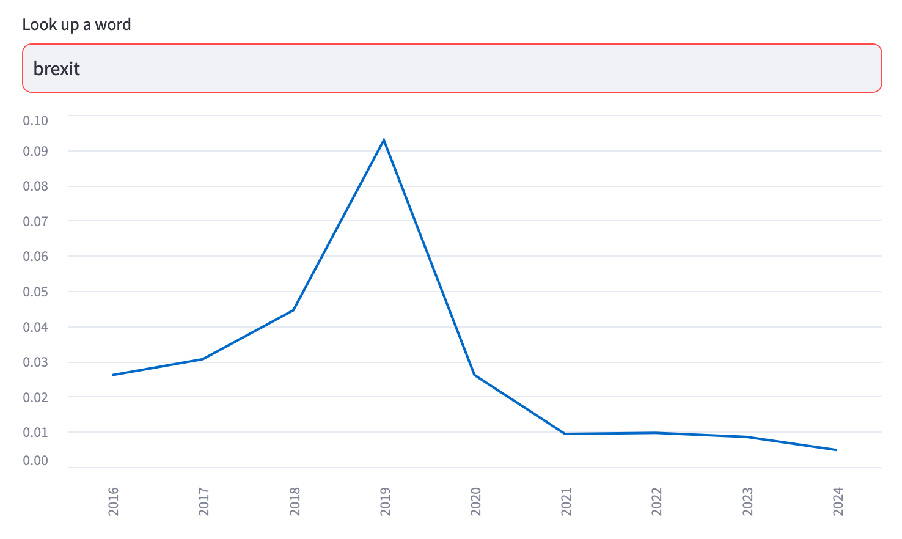

# senedd_words

This app allows you to seach everything that's been said in the Welsh parliament, the Senedd, since the election of May 2016. It uses the [files](https://www.theyworkforyou.com/pwdata/scrapedxml/senedd/en/) that [They Work For You](https://www.theyworkforyou.com/) produce from what the Senedd publishes as open data.

It takes [the Westminster version](https://parli-n-grams.puntofisso.net/) built by [@puntofisso](https://puntofisso.net/) as inspiration.

Looking up a word will show how frequently it was used in the parliament as a proportion of all the words uttered that year. So looking up 'Brexit' shows it was used much more often in 2019, as a proportion of everything said that year.

